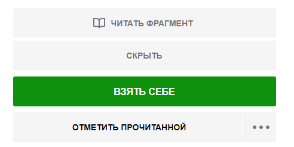

# LitRes helper

## Описание
Пользовательский скрипт для сайта [ЛитРес](https://www.litres.ru/)

После установки скрипта появится возможность исключить из списка предлагаемых книг, раздаваемых по промокоду, уже имеющиеся в Вашей билиотеке.
По умолчанию данная возможность включена. Для отключения в стандартном выпадающем меню с фильтром (электронные/аудио/все) необходимо выбрать пункт **Скрыть Мои книги**:

Также имеется возможность скрывать отдельные книги из предлагаемого списка, чтобы они не показывалиь и в дальнейшем для других промокодов.
Для этого к каждой книге в списке вверху добавляется кнопка **Скрыть** (Реально книги скрываются после перезагрузки страницы). Для скрытых книг кнопка включает их отображение обратно.
Чтобы отобразить скрытые книги, в выпадающем меню (см. выше) необходимо выбрать пункт **Показать скрытые**.

Кроме того, кнопка Скрыть/Показать будет также присутствовать на странице отдельной книги:

Книги, уже присутствующие в Вашей библиотеке, не скрываются.

Настройки и список скрытых книг не сихронизируются между браузерами.

## Установка
В браузере предварительно должно быть установлено расширение TamperMonkey:  
[Для Chrome и его родственников](https://chrome.google.com/webstore/detail/tampermonkey/dhdgffkkebhmkfjojejmpbldmpobfkfo)  
[Для Firefox](https://addons.mozilla.org/en-US/firefox/addon/tampermonkey/).   
Или смотрите на http://tampermonkey.net/. 

После установки TamperMonkey необходимо перейти [по ссылке](https://github.com/alezhu/litres_helper/raw/master/litres_helper.user.js) и в открывшемся окне  TamperMonkey  нажать кнопку Установить. После чего открыть/обновить страницу Litres.
